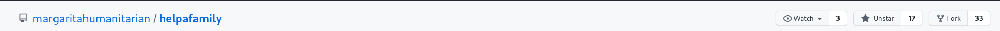
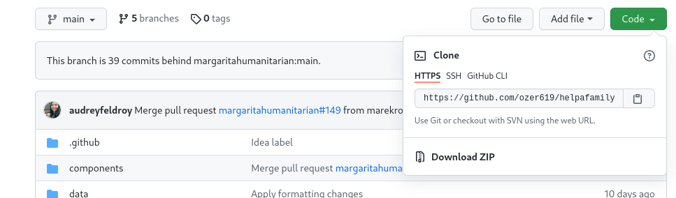
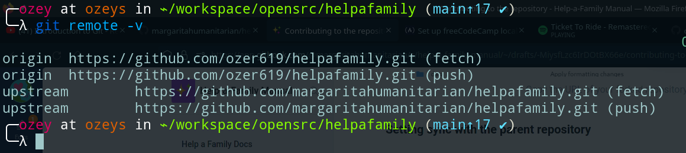
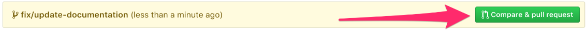

# Contributing to Help-a-Family

Want to contribute to [https://github.com/margaritahumanitarian/helpafamily](https://github.com/margaritahumanitarian/helpafamily) repository? That's great! These instructions will help you contribute.

Prerequisites: You should have these installed:

1. npm and node
2. git command line tool.
3. yarn **package** manager.

### Contribution workflow

#### Fork the repository on GitHub

Follow these steps to fork the helpafamily repository:

1. Go to helpafamily repository [https://github.com/margaritahumanitarian/helpafamily](https://github.com/margaritahumanitarian/helpafamily).
2. Click the "Fork" Button in the upper right-hand corner of the page.



#### After forking the repo

1. After the repository has been forked, you will be taken to your copy of the helpafamily repository at `https://github.com/YOUR_USER_NAME/helpafamily` \(`YOUR_USER_NAME` would be replaced with your GitHub username.\)

### Clone your fork from GitHub

When you create a repository on GitHub, it exists as a remote repository. You can clone your repository to create a local copy on your computer and sync between the two locations.

Follow these steps to clone the helpafamily repository:

1. Copy the URL of your forked repository.   
2. Open your terminal and change the present directory to the one where you want to clone the repo,            you can do this by using the cd command.
3. Use the following command `git clone <URL that you copied>`.



### Setting sync with the parent repository

Now that we have downloaded a copy of our fork, we will need to set up an `upstream` remote to the parent repository.

The main repository is referred `upstream` repository. Your fork referred to as the `origin` repository.

We need a reference from our local clone to the `upstream` repository in addition to the `origin` repository. This is so that we can sync changes from the main repository without the requirement of forking and cloning repeatedly.

Follow these steps to sync with the helpafamily repository:

1.  Go into the new cloned directory:
   ```bash
   cd helpafamily
   ```
2. Add a remote reference to the main helpafamily repository:

   ```bash
   git remote add upstream https://github.com/margaritahumanitarian/helpafamily.git
   ```
3. Ensure the configuration looks correct:

   ```bash
   git remote -v
   ```



### Running helpafamily locally

Follow these steps to run the helpafamily web app locally:

1. if you are not already in the cloned directory.
   ```bash
   cd helpafamily/
   ```
2. Copy the environment variables.
   ```bash
   cp .env.example .env
   ```
3. Install dependency's
   ```bash
   yarn install
   ```
4. Start the server.
   ```bash
   yarn dev
   ```

#### If you're familiar with Docker:

`docker-compose build` \(it builds the docker container - needed only the first time or whenever the container gets removed\)

`docker-compose up` \(it runs the app inside the container\)

Then open [http://127.0.0.1:3000](http://127.0.0.1:3000)

### Making changes locally and creating a pull request:

Follow these steps:

1. Validate that you are on the `main` branch:
   ```bash
   git status
   ```
2. You should get this in the command line:  

    `on branch main Your branch is up-to-date with 'origin/main'.  nothing to commit, working directory clean`

3. Sync the latest changes from the helpafamily upstream `main` branch to your local main branch:  

    ```bash
    git fetch upstream
    ```

4. Merges upstream main to local main.
   ```bash
   git merge upstream/main
   ```

####    Creating a fresh branch for changes:

Working on a separate branch for each issue helps you keep your local working copy clean. You should never work on the `main`.

1. Create new branch and switch to it:
   ```bash
   git checkout -b fix_some_issue
   ```

2. Edit the files and once your ready to create a pull request :

3. ```bash
   git add .
   ```

4. ```bash
   git commit -m "short message"
   ```

5. ```bash
   git push origin branch/name-here
   ```  


### Proposing a Pull Request:

You will be prompted to create a pull request on your fork's GitHub Page.  




### Credits

These instructions were adapted from:  
[ https://contribute.freecodecamp.org/\#/how-to-setup-freecodecamp-locally](%20https://contribute.freecodecamp.org/#/how-to-setup-freecodecamp-locally)
