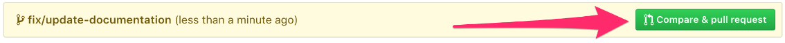

# Contributing to Help-a-Family

Want to contribute to [https://github.com/margaritahumanitarian/helpafamily](https://github.com/margaritahumanitarian/helpafamily) repository? That's great! These instructions will help you contribute.

### Prerequisites

You should have these installed:

1. npm and node
2. git command line tool.
3. yarn **package** manager.

### Contribution workflow

See [Fork and Clone the Repo](fork-and-clone-the-repo.md).

### Setting sync with the parent repository

Now that we have downloaded a copy of our fork, we will need to set up an `upstream` remote to the parent repository.

The main repository is referred `upstream` repository. Your fork referred to as the `origin` repository.

We need a reference from our local clone to the `upstream` repository in addition to the `origin` repository. This is so that we can sync changes from the main repository without the requirement of forking and cloning repeatedly.

Follow these steps to sync with the helpafamily repository:

1. Change the directory to the new cloned one `cd helpafamily` 
2. Add a remote reference to the main helpafamily repository:

   ```text
   git remote add upstream https://github.com/margaritahumanitarian/helpafamily.git
   ```

   3. Ensure the configuration looks correct:

```bash
git remote -v
```


### Running helpafamily locally

Follow these steps to run the helpafamily web app locally:

1. `cd helpafamily/` if you are not already in the cloned directory.
2. `cp .env.example .env` 
3. `yarn install`
4. `yarn dev`

#### If you're familiar with Docker:

`docker-compose build` \(it builds the docker container - needed only the first time or whenever the container gets removed\)

`docker-compose up` \(it runs the app inside the container\)

Then open [http://127.0.0.1:3000](http://127.0.0.1:3000)

### Making changes locally and creating a pull request:

Follow these steps:

1. Validate that you are on the `main` branch: `git status`
2. You should get this in the command line:  `on branch main Your branch is up-to-date with 'origin/main'.  nothing to commit, working directory clean`

    3. Sync the latest changes from the helpafamily upstream `main` branch to your local main branch:  
         `git fetch upstream`

    4. `git merge upstream/main` \(merges upstream main to local main\).

####    Creating a fresh branch for changes:

Working on a separate branch for each issue helps you keep your local working copy clean. You should never work on the `main`.

1. Create new branch and switch to it: `git checkout -b fix_some_issue`

    2. Edit the files and once your ready to create a pull request :

    3. `git add .`

    4. `git commit -m "short message"`

    5. `git push origin branch/name-here`  
  

### Proposing a Pull Request:

You will be prompted to create a pull request on your fork's GitHub Page.  




### Credits

These instructions were adapted from:  
[ https://contribute.freecodecamp.org/\#/how-to-setup-freecodecamp-locally](%20https://contribute.freecodecamp.org/#/how-to-setup-freecodecamp-locally)


