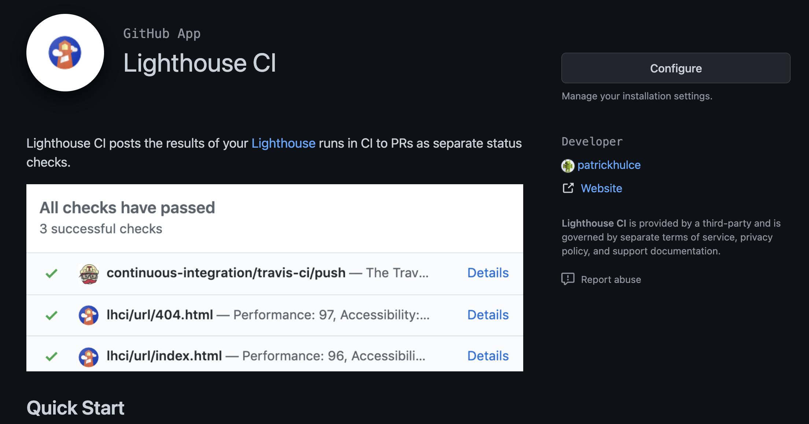
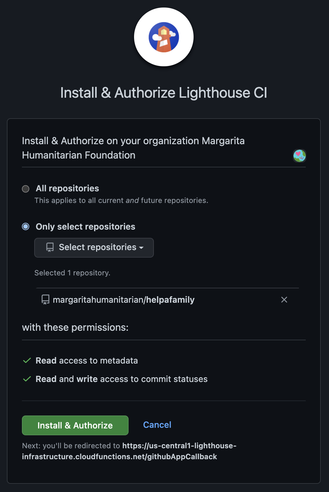
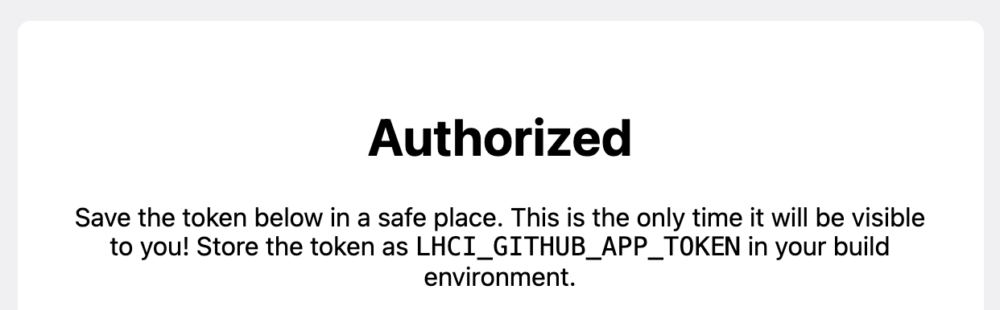
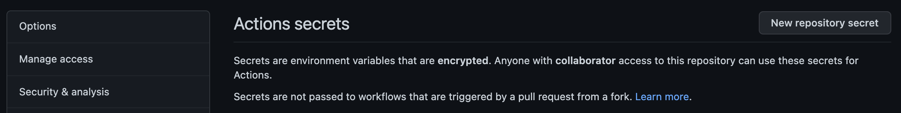
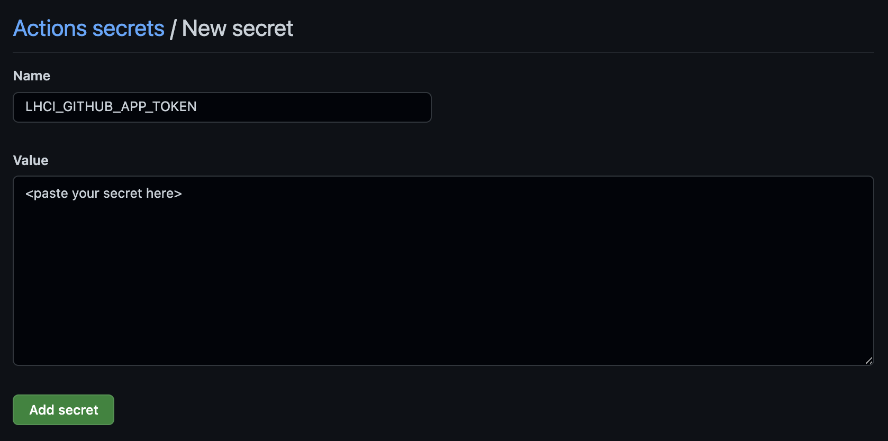
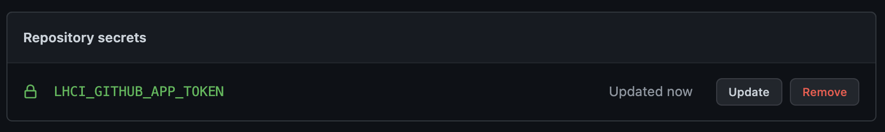

# Lighthouse CI

Lighthouse is a tool for testing page speed and performance. We use it with a GitHub action to performance-test pull requests.

### Target Audience: Other Nonprofit Organizations

This info is only for those who are deploying a production instance of Help-a-Family. 

It's not necessary for most developers contributing to Help-a-Family to follow these instructions.

### Getting a Lighthouse CI GitHub App Token

When setting up this project for your GitHub organization, you'll need to add `LHCI_GITHUB_APP_TOKEN` to the project's Settings on GitHub.

First, generate your token by installing the Lighthouse CI app: [https://github.com/apps/lighthouse-ci](https://github.com/apps/lighthouse-ci)

Install Lighthouse CI to only the helpafamily repo for your org:

Copy-paste the `LHCI_GITHUB_APP_TOKEN` to your .env file so you don't lose it:

Add the new repo secret:

Paste your secret in:

Your secret should now show up:

